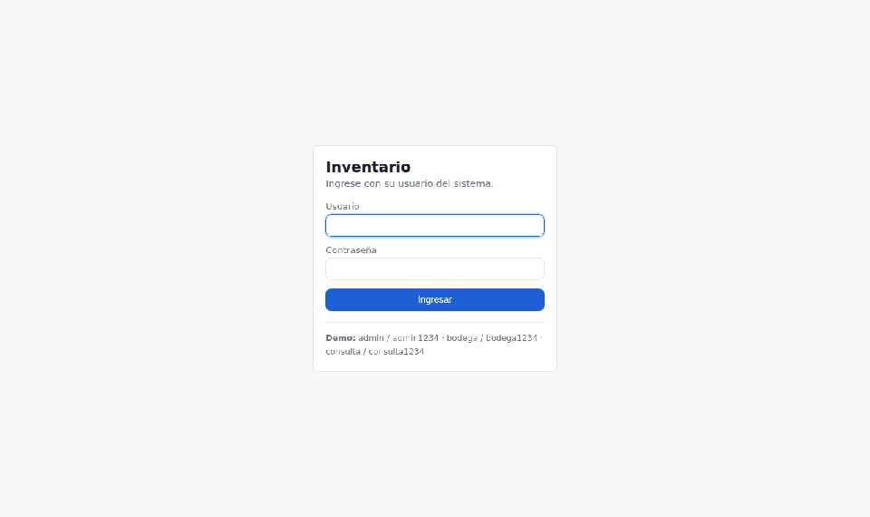
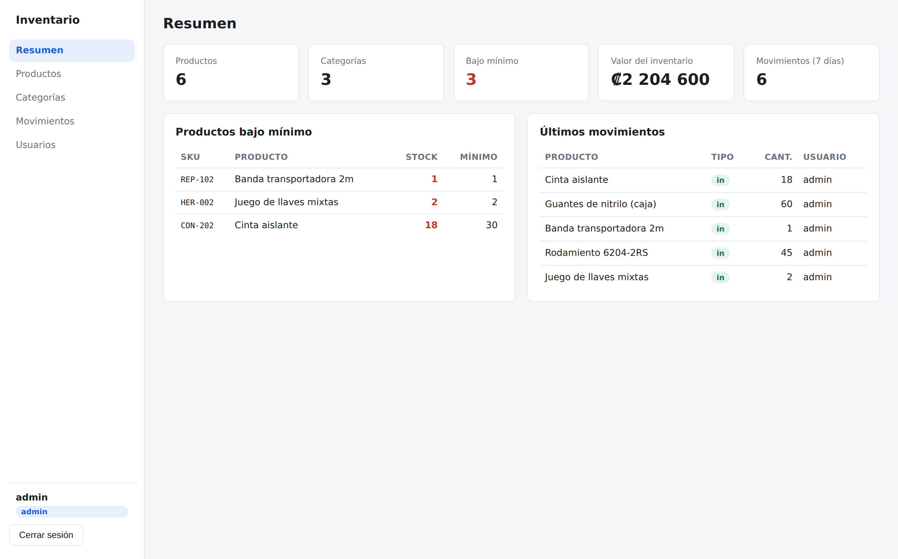
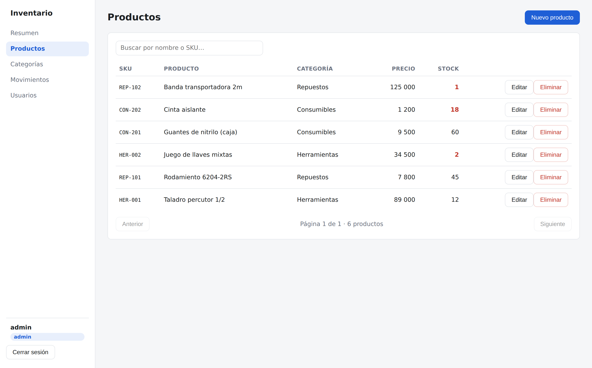
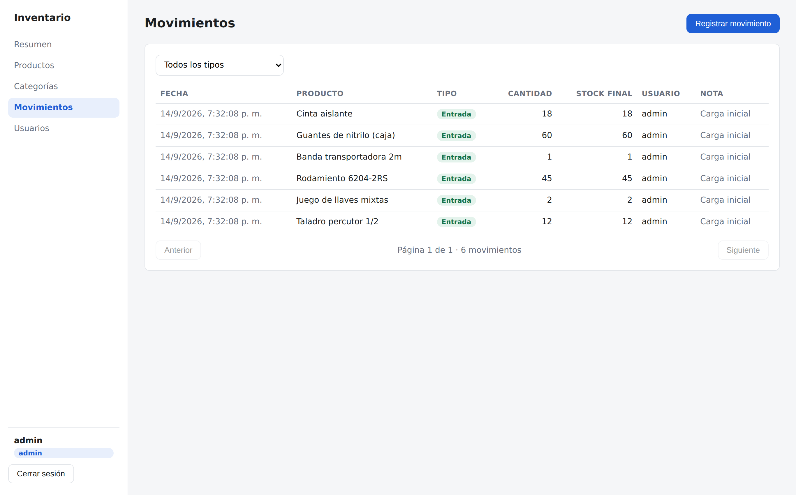
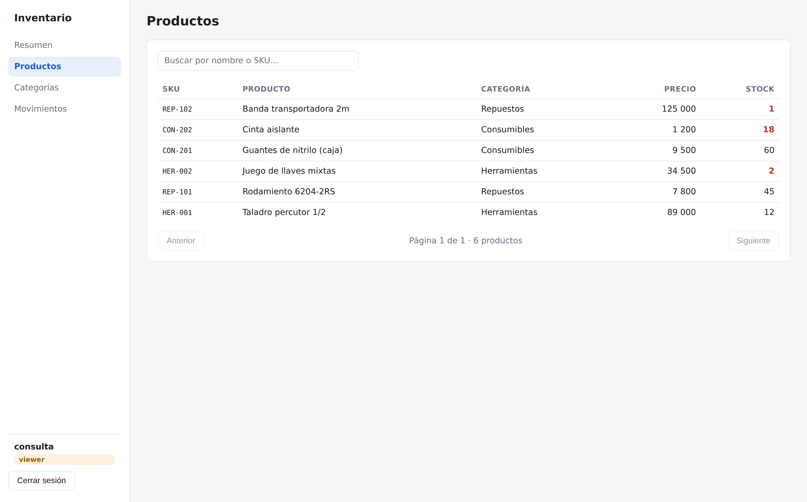

# Inventory Dashboard

Interfaz React para [inventory-api](https://github.com/Aaronloji/inventory-api): login con JWT, renovación automática de token, CRUD de productos y categorías, registro de movimientos de stock y vistas distintas según el rol del usuario.



## Stack

| Componente | Tecnología |
|---|---|
| UI | React 18 |
| Build | Vite 5 |
| Ruteo | React Router 6 |
| HTTP | Axios con interceptores |
| Estilos | CSS propio, sin framework |

## Qué incluye

- **Sesión con refresh transparente.** Si el access token expira, un interceptor lo renueva con el refresh token y reintenta la petición original. El usuario no ve el corte.
- **Rutas protegidas.** `ProtectedRoute` valida sesión y rol antes de montar la vista; `/usuarios` solo existe para admin.
- **UI según rol.** Los botones de escritura y borrado se ocultan para quien no tiene permiso. La decisión real la toma el backend; esto solo evita mostrar acciones que van a fallar.
- **Tablas con búsqueda, filtros y paginación** servidas por el API, no en memoria.
- **Diseño responsive** hasta ancho de teléfono.

## Pantallas

| Resumen | Productos |
|---|---|
|  |  |

| Movimientos | Mismo listado con rol `viewer` |
|---|---|
|  |  |

El resumen muestra productos bajo mínimo, valor del inventario y los últimos movimientos. La vista de `viewer` es la misma pantalla sin acciones de escritura.

## Cómo correrlo

Requiere el API corriendo en `http://localhost:5000` (ver [inventory-api](https://github.com/Aaronloji/inventory-api)).

```bash
git clone https://github.com/Aaronloji/inventory-dashboard.git
cd inventory-dashboard
npm install
cp .env.example .env     # VITE_API_URL apunta al API
npm run dev
```

Abrir `http://localhost:5173`.

### Usuarios de ejemplo

| Usuario | Contraseña | Rol | Qué puede hacer |
|---|---|---|---|
| admin | admin1234 | admin | Todo, incluyendo usuarios y borrados |
| bodega | bodega1234 | manager | Crear y editar productos, registrar movimientos |
| consulta | consulta1234 | viewer | Solo consultar |

## Despliegue

Es un sitio estático: `npm run build` genera `dist/`.

En Render (Static Site) o Netlify:

- **Build command:** `npm run build`
- **Publish directory:** `dist`
- **Variable de entorno:** `VITE_API_URL` con la URL pública del API

`public/_redirects` ya reescribe todas las rutas a `index.html` para que el ruteo del lado del cliente funcione al recargar.

## Estructura

```
src/
├── api/client.js          # Axios: token en cada request, refresh automático al 401
├── context/AuthContext.jsx # Sesión, rol y helper de permisos
├── components/            # Layout, ProtectedRoute, Modal
└── pages/                 # Login, Resumen, Productos, Categorías, Movimientos, Usuarios
```

## Licencia

MIT
